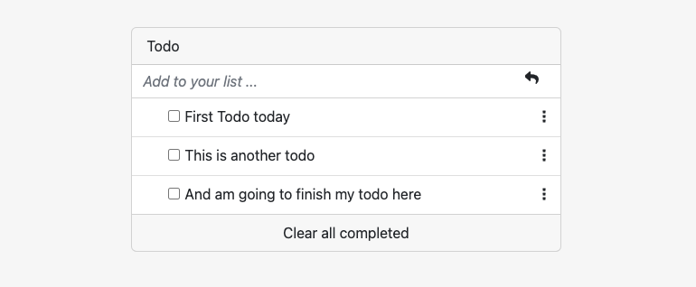

# Sneak Peak ToDo List

> Todo list build with webpack.

## Built With

- HTML
- CSS
- JAVASCRIPT
- Webpack

## Getting Started

**To get a local copy up and running follow these simple example steps.**

### Prerequisites

- Node
- Git
- Code Editor

### Setup

- Clone the repository
- Change directory into the project folder
- Open project with text editor to view changes

### Install

- Install dependencies `npm install`

- The project is build with webpack so you need to start the dev server with the following command `npm run start`

### Live Demo

[Live Demo Link](https://learnwithalfred.github.io/alfred-sneak-peek--to-do/)

👤 **Alfred Boateng**

- GitHub: [@learnwithalfred](https://github.com/learnwithalfred)
- Twitter: [@kb_alfred](https://twitter.com/kb_alfred)
- LinkedIn: [Alfred Boateng](https://www.linkedin.com/in/alfred-boateng-704670138/)

## 🤝 Contributing

Contributions, issues, and feature requests are welcome!

Feel free to check the [issues page](../../issues/).

## Show your support

Give a ⭐️ if you like this project!

## Acknowledgments

- Project Design and inspiration from [Microverse Bootcamp](https://www.microverse.org)

## 📝 License

This project is [MIT](./MIT.md) licensed.
